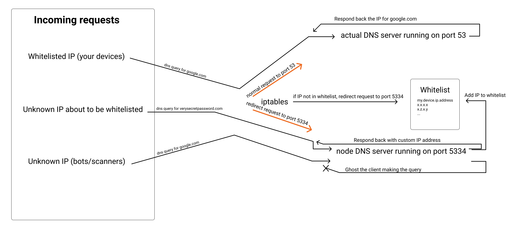

# secret-dns

> Undiscoverable publicly accessible password-protected DNS

## Brief

This package is for people who
- want to access their DNS server using a public IP without using a VPN or wireguard
- do not want their DNS server to be used in DNS amplification attacks
- do not want their DNS server to be discovered by some script kiddie running a DNS scanner
- do not want to manually add IPs to a whitelist
- do not want the hassle of creating a whitelist/blacklist system
- want a package that does all the above that is plug-and-play

## Install

```bash
# Install node and git if you don't have it already
curl -fsSL https://deb.nodesource.com/setup_14.x | sudo -E bash -
sudo apt-get install -y nodejs git

# clone this repository and install dependencies
git clone https://github.com/binary-person/secret-dns
cd secret-dns
npm install
```

## Usage

```bash
sudo src/index.js very_secret_nonexistent_domain_here.com

# return 1.1.1.1 upon querying the password domain
sudo src/index.js very_secret_nonexistent_domain_here.com 1.1.1.1

# clear all iptables chains and rules created by secret-dns
sudo src/index.js cleanup
```

## Running it on startup

```bash
sudo su

# Get pm2 if you don't have it already
npm install -g pm2

# enable pm2 startup if you haven't done so already
pm2 startup

# run secret-dns under pm2
pm2 start --name 'secret-dns' 'node src/index.js very_secret_nonexistent_domain_here.com 1.1.1.1'

# save pm2 configuration
pm2 save
```

## How it works

(Note that since the node server only runs a UDP DNS server, all TCP DNS requests will result in being closed)


